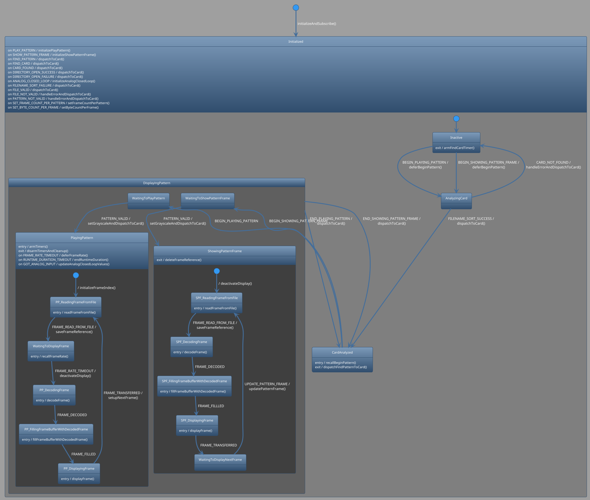

- [Repository Information](#orge0da812)
- [Modular LED Display](#orgd90d016)
- [Development](#org1c5b0e8)

    <!-- This file is generated automatically from metadata -->
    <!-- File edits may be overwritten! -->


<a id="orge0da812"></a>

# Repository Information

-   Library Name: ArenaController
-   Description: Arduino library for communicating with the Reiser Lab Modular LED panels display arena.
-   Version: 5.0.0
-   Panel Version: G4 v1.9
-   Release Date: 2025-10-17
-   Creation Date: 2023-08-16
-   License: GPL-3.0
-   URL: <https://github.com/janelia-arduino/ArenaController>
-   Author: Peter Polidoro
-   Email: peter@polidoro.io
-   Copyright: 2025 Howard Hughes Medical Institute
-   References:
    -   <https://github.com/janelia-python/arena_interface_python>
    -   <https://reiserlab.github.io/Modular-LED-Display/>
    -   <https://github.com/floesche/LED-Display_G4_Hardware_Arena>
    -   <https://github.com/leburnett/G4_Display_Tools>
    -   <https://www.pjrc.com/store/teensy41.html>
    -   <https://www.pjrc.com/store/ethernet_kit.html>
    -   <https://github.com/QuantumLeaps/qp-arduino>
    -   <https://mongoose.ws/>
    -   <https://www.adafruit.com/product/4470>
    -   <https://www.adafruit.com/product/1083>


<a id="orgd90d016"></a>

# Modular LED Display


Abstract from <https://doi.org/10.1101/2022.08.02.502550> :

"Visual stimulation of animals in the laboratory is a powerful technique for studying sensory control of complex behaviors.

Since commercial displays are optimized for human vision, we established a novel display system based on custom-built modular LED panels that provides millisecond refresh, precise synchronization, customizable color combinations, and varied display configurations.

This system simplifies challenging experiments.

With variants of this display, we probed the speed limits of motion vision and examined the role of color vision in behavioral experiments with tethered flying Drosophila.

Using 2-photon calcium imaging, we comprehensively mapped the tuning of visual projection neurons across the fly’s field of view.

Finally, using real-time behavior analysis, we developed low-latency interactive virtual environments and found that flying flies can independently control their navigation along two dimensions.

This display system uniquely addresses most technical challenges of small animal vision experiments and is thoroughly documented for replicability."


## System Components


### Quarter Panel

A quarter panel is a set of LED pixels arranged in rows and columns.


### Panel

A panel is a set of quarter panels arranged in rows and columns.


### Region

A region is a set of panels arranged in rows and columns with a common communication interface.


### Display

An display is a set of regions arranged in rows and columns.


## Display Messages


### Quarter Panel

1.  Pixels

    Pixel numbering for each pixel in a quarter panel:
    
    

2.  Grayscale

    In grayscale mode, each LED can be one of sixteen brightness levels.
    
    
    
    

3.  Binary

    In binary mode, each LED can be one of two brightness levels, on or off.
    
    
    
    


### Panel

1.  Quarter Panels in Panel

    Quarter panel numbering for each quarter panel in a panel plus pixel numbering for select pixels in a panel:
    
    


### Region

1.  Regions in Display

    Region numbering for each region in an display:
    
    

2.  Panels in Region

    Panel numbering for each panel in an region:
    
    


### Display

1.  Panels in Display

    Panel update order for each panel in an display:
    
    1.  Synchronous
    
        
    
    2.  Asynchronous
    
        


## Firmware


### Active Objects

| name                     | priority | event-queue-count | state-machines                   |
|------------------------ |-------- |----------------- |-------------------------------- |
| Watchdog                 | 1        | 2                 | Watchdog                         |
| SerialCommandInterface   | 2        | 10                | SerialCommandInterface           |
| EthernetCommandInterface | 3        | 10                | EthernetCommandInterface         |
| Pattern                  | 4        | 20                | Pattern, Card                    |
| Arena                    | 5        | 20                | Arena, AnalogOutput, AnalogInput |
| Display                  | 6        | 20                | Display                          |
| Frame                    | 7        | 20                | Frame                            |


### State Diagrams

1.  Watchdog

    

2.  SerialCommandInterface

    

3.  EthernetCommandInterface

    

4.  Pattern

    

5.  Card

    

6.  Arena

    

7.  AnalogOutput

    

8.  AnalogInput

    

9.  Display

    

10. Frame

    


## Command Set


<a id="org1c5b0e8"></a>

# Development


## Download this repository

<https://github.com/janelia-arduino/ArenaController.git>

```sh
sudo apt install -y git
mkdir -p ~/tmp && cd ~/tmp && git clone https://github.com/janelia-arduino/ArenaController.git
```


## PlatformIO


### Install PlatformIO Core

<https://docs.platformio.org/en/latest/core/installation/index.html>

1.  Example

    ```sh
    python3 -m venv .venv
    source .venv/bin/activate
    pip install pip --upgrade
    pip install platformio
    pio --version
    ```

2.  99-platformio-udev.rules

    Linux users have to install udev rules for PlatformIO supported boards/devices.
    
    1.  Download udev rules file to /etc/udev/rules.d
    
        ```sh
        curl -fsSL https://raw.githubusercontent.com/platformio/platformio-core/develop/platformio/assets/system/99-platformio-udev.rules | sudo tee /etc/udev/rules.d/99-platformio-udev.rules
        ```
    
    2.  Restart udev management tool
    
        ```sh
        sudo service udev restart
        ```
    
    3.  Add user to groups
    
        ```sh
        sudo usermod -a -G dialout $USER
        sudo usermod -a -G plugdev $USER
        ```
    
    4.  Remove modemmanager
    
        ```sh
        sudo apt-get purge --auto-remove modemmanager
        ```


### Compile the firmware

```sh
make teensy-firmware
```


### Upload the firmware

```sh
make teensy-upload
```


### Monitor

```sh
make monitor
```
